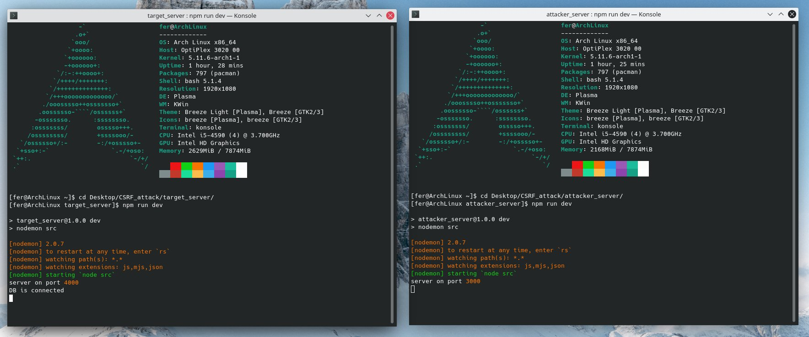
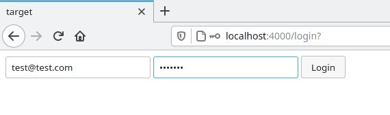
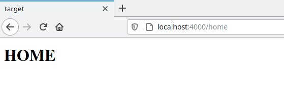
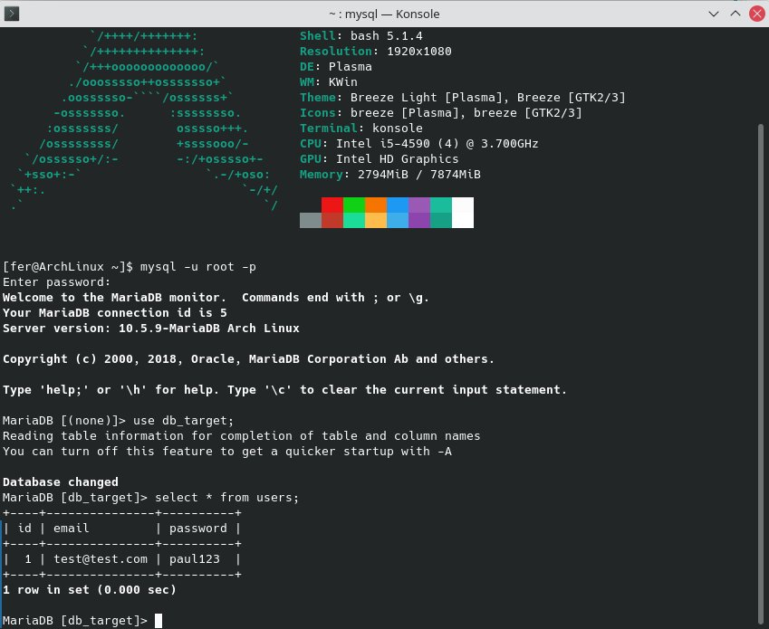
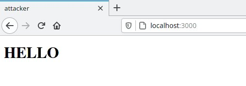
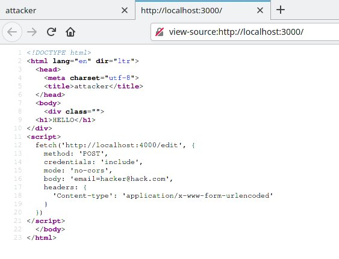
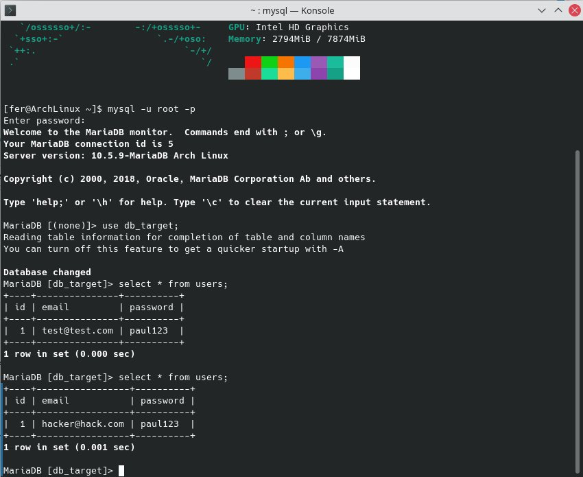
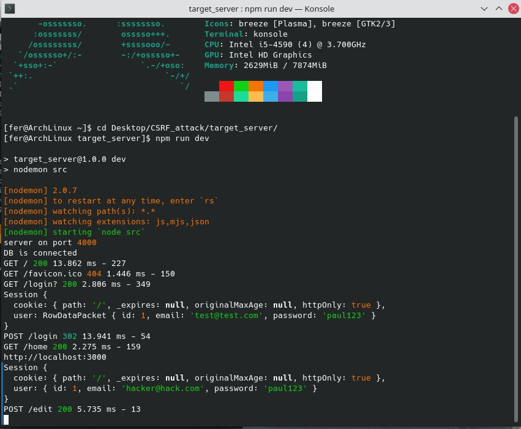

# CSRF_attack
The purpose of this repo is to understand and learn about the ***cross-site request forgery*** vulnerability that a basic server might face. For that, I have programmed 2 basic servers in nodejs using express, handlebars and mysql.

## Structure
* **attacker_server**: this would be programmed and spreded massively via email by an hypothetical cracker.
* **target_server**: this would be the target vulnerable server that the cracker wants to attack.

## Cross-site request forgery
This vulnerability consists on taking advantage of the session of the target-server's trusted user in the web-browser. When the victim clicks on the link of the attacker-server (typically shared by email), it appeares to happend nothing. But a script runs behind, making a petition from the attacker-server to the target one with the session-id of the trusted user. Likewise, from the point of view of the target-server, it is the trusted user who is making the HTTP petitions, not the cracker.
* more info: https://en.wikipedia.org/wiki/Cross-site_request_forgery

**In this lab, the purpose of the attacker is to change the registered email of the trusted user in the target-server.**

## Process

* **Starting the both servers.**

* **The trusted user signups in the target-server and creates a session.**

* **As usual he is redirected to the home page.**

* **Here is the user data storage in the db.**

* **After some time he receives an interesting email and he clicks in the link. And he is redirected to some beatiful web page and nothing special happends ;)**

* **He is not aware of the hidden post request, using the web-browser's fetch api. The purpose of the post petition is to change the victim email.**

* **Here is the prove that the attack has been successful!**

* **As we can see in the target server console log, the email used in the session has changed.**

